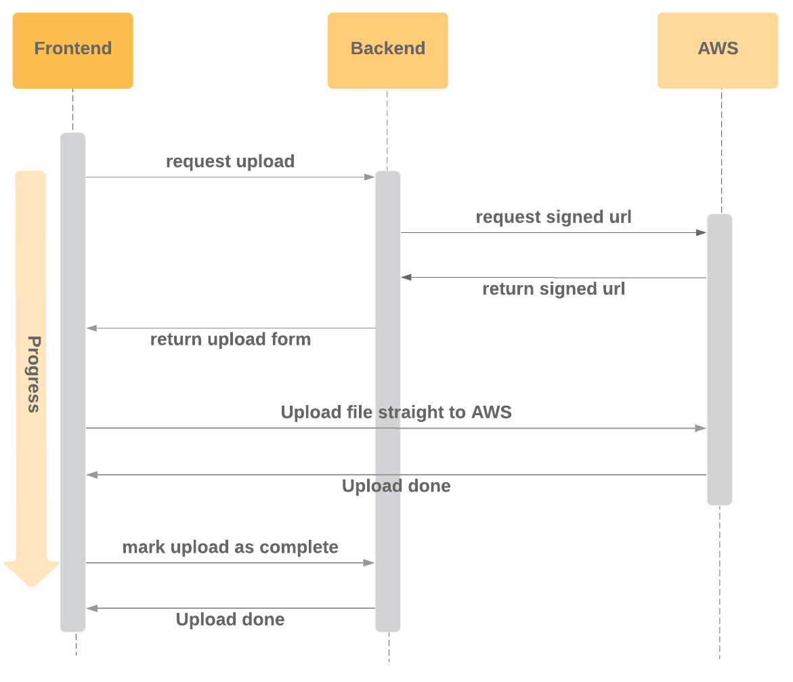

Django S3 File Upload Server
===================
[](https://travis-ci.com/dabapps/django-s3-file-upload-server)

Upload files from the browser to S3 - server side implementation

For the client side implementation, see [github.com/dabapps/django-s3-file-upload-client](https://github.com/dabapps/django-s3-file-upload-client)

## Getting Started

### Installation

Add the following to `requirement.txt`

    git+git://github.com/dabapps/django-s3-file-upload-server.git


Add the following to your `settings.py`

    INSTALLED_APPS = (
        ...
        's3_file_uploads',
        ...
    )

    ...

    # S3
    AWS_BUCKET_NAME = env('S3_BUCKET_NAME')
    AWS_STORAGE_BUCKET_NAME = AWS_BUCKET_NAME
    AWS_ACCESS_KEY_ID = env('AWS_ACCESS_KEY_ID')
    AWS_SECRET_ACCESS_KEY = env('AWS_SECRET_ACCESS_KEY')

**Please make sure to**
  - **set a `MAX_FILE_UPLOAD_SIZE` in `settings.py`.**
  - **run migrations to create the `UploadedFile` table in your database.**

### Setup environment variables

You will need to create an AWS bucket and set the following env variables

```
AWS_ACCESS_KEY_ID
AWS_SECRET_ACCESS_KEY
S3_BUCKET_NAME
```

## Usage
The flow to be able to upload files from the browser straight to AWS is as follows.


This repo will give you access to some useful enpoints.
To make these endpoints available, add the following to the `urlpatterns`
```
  url(r'^s3-file-uploads/', view=include('s3_file_uploads.urls'))
```
This will give you access to
  - POST `/s3-file-uploads/` for getting a url to upload files to AWS to
  - POST `/s3-file-uploads/<file_id>/complete/` for marking an upload as complete
  - GET `/s3-file-uploads/<file_id>/` for getting an AWS endpoint to download files from

Hitting these endpoints will `create`, `update` and `retrieve` instances of `UploadedFile` under the hood.

For an abstraction of uploading a file from the browser straight to S3, see [github.com/dabapps/django-s3-file-upload-client](https://github.com/dabapps/django-s3-file-upload-client)

## Examples
Now that we have the table `UploadedFile` available to us, which stores an `id`, `file_key`, `filename` and `file_upload_state`, we might want to link this to a model in our project as follows.

```
from django.db import models
from s3_file_uploads.models import UploadedFile

class Llama(models.Model):
    file = models.OneToOneField(
        UploadedFile,
        on_delete=models.CASCADE
    )
```

Now we could setup some endpoints to `create/update` a `Llama` instance for example.

After a file has been uploaded to S3 by the client, the frontend will have the `file_id` and could use this
to `create/update` the `Llama` instance.

### Downloading a file
As noted above in the list of available endpoints, we can do a GET request to`/s3-file-uploads/<file_id>/` to get the AWS endpoint to download a file from.
This endpoint is useful when the frontend knows the `file_id` and wants to retreive a single file.

We might also want to setup an endpoint to retrieve all `Llama` data and include the download url for the `file`.
Say we have an instance of `Llama` called `llama`. All we need to do is call the model method `llama.get_download_url()` or `llama.get_view_url()` which returns the S3 url including access keys where the file can be downloaded or viewed from.


## Code of conduct

For guidelines regarding the code of conduct when contributing to this repository please review [https://www.dabapps.com/open-source/code-of-conduct/](https://www.dabapps.com/open-source/code-of-conduct/)
